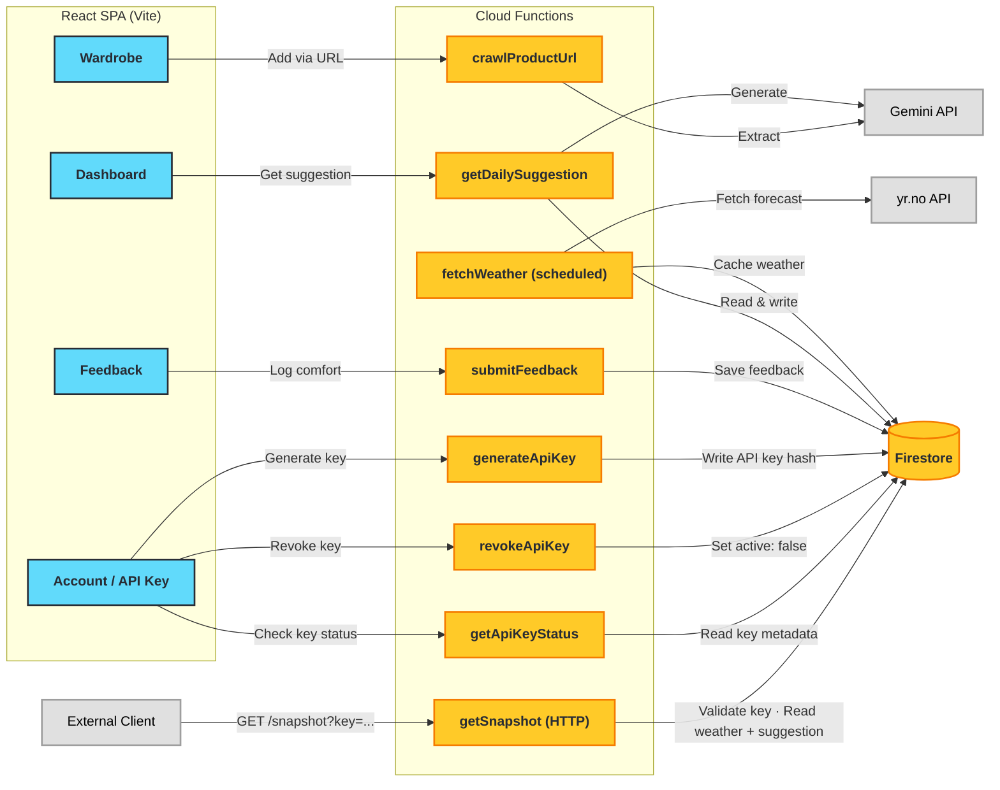

#  WeatherWear

A personal clothing suggestion app that recommends outerwear and layering choices each morning based on the full-day weather forecast in Nordic climates.

🔗 **Live app:** [weatherwear.ashen.no](https://weatherwear.ashen.no/)

<p align="center">
  
</p>

## 🌟 The Problem

After migrating from Sri Lanka to Oslo 3 years ago, deciding what jacket to wear, how many layers to put on, and what accessories to bring remains a **daily challenge**. Norwegian weather varies significantly and requires wardrobe decisions that aren't intuitive for someone from a tropical climate.

The same **-5°C** can feel completely different depending on moisture and wind — a dry, calm morning is manageable in a fleece and shell, but add sleet and 10 m/s gusts and you'll be miserable without full waterproof layers.

## 💡 The Solution

**WeatherWear** takes the guesswork out of your morning routine. It analyzes the **full-day weather forecast**, classifies conditions using Nordic-specific logic (*Wet Slush*, *Windy Cold*, *Dry Cold*, etc.), and generates **personalized layering recommendations** from your actual wardrobe — powered by Google Gemini AI. Over time, it learns your personal cold tolerance through a feedback loop, so suggestions get better the more you use it.

## ✨ Features

- 🧥 **AI-Powered Daily Outfit Suggestions** — Every morning, get a complete layering recommendation (base → mid → outer + accessories) generated by Google Gemini based on the full-day weather forecast.
- 🌡️ **Smart Weather Classification ("Oslo Logic")** — Goes beyond raw temperature. Classifies conditions into categories like *Wet Slush*, *Windy Cold*, *Dry Cold*, and *Mild Damp* to understand the real *feel* of the day.
- 📸 **Lazy Onboarding via Product URLs** — Add items to your wardrobe simply by pasting a product URL (e.g. Zalando, Norrøna, Uniqlo). The app auto-extracts name, material, warmth level, and weather resistance using AI.
- 🔄 **Feedback & Learning Loop** — Log what you wore and rate your comfort. The AI learns your personal temperature tolerance over time and calibrates future suggestions accordingly.
- 🔐 **Secure & Personal** — Google sign-in via Firebase Auth. Your wardrobe data is private and secured with Firestore rules.
- 📡 **Thin Client / External Access** — Generate a personal API key from the Account page and pull today's weather + suggestion via a single `GET /snapshot?key=<apiKey>` REST call — no browser, Firebase SDK, or OAuth flow needed. Perfect for e-ink displays, Raspberry Pi dashboards, or home-automation scripts.

---

## 📸 Screenshots

### Dashboard — Outfit of the Day
The dashboard shows today's AI-generated outfit suggestion with detailed reasoning for each layer, optimized for the current weather conditions.

<p align="center">
  
</p>

<p align="center">
  
</p>

### Wardrobe Management
A filterable, searchable grid of your clothing items showing warmth levels, weather properties, and temperature ranges at a glance.

<p align="center">
  
</p>

---

## 🛠️ Tech Stack

| Layer | Technology |
|-------|-----------|
| **Frontend** | React 19, Vite, TypeScript |
| **UI** | Chakra UI v3, Emotion, React Icons |
| **Backend** | Firebase Cloud Functions |
| **Database** | Firestore |
| **Auth** | Firebase Auth (Google sign-in) |
| **Hosting** | Firebase Hosting |
| **AI** | Google Gemini API (via Firebase) |
| **Weather** | yr.no Locationforecast 2.0 API |

---

## 🏗️ Architecture



**How it works:**
1. A scheduled function fetches the hourly forecast from yr.no → aggregates into time periods → classifies with "Oslo Logic" → caches in Firestore.
2. User opens the app → `getDailySuggestion` reads weather + wardrobe + feedback history → builds a structured prompt → Gemini returns a personalized layering recommendation.
3. User can optionally submit comfort feedback to improve future suggestions.
4. Users can generate a personal API key from the Account page and access today's data from any HTTP client via `GET /snapshot?key=<apiKey>`.

---

## 🚀 Getting Started

### Prerequisites

- **Node.js** v18+
- **Firebase CLI** — `npm install -g firebase-tools`
- A Firebase project with Firestore, Auth (Google sign-in), Cloud Functions, and Cloud Storage enabled
- Google Gemini API Key

### Installation

1. **Clone the repository:**
   ```bash
   git clone https://github.com/ashenw/weatherwear.git
   cd weatherwear
   ```

2. **Install dependencies:**
   ```bash
   npm install
   ```

3. **Configure Firebase project:**
   Create a `.firebaserc` file in the project root pointing to your Firebase project:
   ```json
   {
     "projects": {
       "default": "your-firebase-project-id"
     }
   }
   ```

4. **Configure environment variables:**
   Copy `.env.example` to `.env.local` and fill in your Firebase and Gemini credentials.

5. **Start Firebase Emulators:**
   ```bash
   ./emulators.sh
   ```

6. **Run the development server:**
   ```bash
   npm run dev
   ```

7. Open `http://localhost:5173` in your browser.

---

## 🧪 Testing

```bash
# Run tests
npm test

# Watch mode
npm run test:watch

# Coverage
npm run test:coverage
```

---

## 📖 Documentation

- [Project Specification](docs/SPEC.md) — full technical spec, data schemas, and API definitions
- [Deployment Guide](docs/DEPLOYMENT.md) — how to deploy to production Firebase
- [Testing Guide](docs/TESTING.md) — testing strategy and fixtures

---

## � External API — `/snapshot` Endpoint

WeatherWear exposes a single public REST endpoint for thin clients (e-ink displays, Raspberry Pi scripts, home-automation dashboards, etc.).

### Generate an API key

1. Sign in to the web app and click your avatar (top right) to open the **Account** page.
2. Click **Generate API key**.
3. Copy the key from the dialog — it is shown **once only** and never stored in plain text.

### Request

```
GET https://europe-west1-<your-project>.cloudfunctions.net/getSnapshot?key=<apiKey>
```

### Response

```json
{
  "date": "2026-03-13",
  "weather": {
    "conditionType": "wet-cold",
    "windWarning": false,
    "periods": {
      "morning":   { "temp": -1, "feelsLike": -5, "precipitation": 0.4, "wind": 4.2, "symbol": "lightsnow" },
      "daytime":   { "temp": 1,  "feelsLike": -2, "precipitation": 1.1, "wind": 5.0, "symbol": "sleet" },
      "afternoon": { "temp": 2,  "feelsLike": -1, "precipitation": 0.2, "wind": 3.8, "symbol": "cloudy" },
      "evening":   { "temp": 0,  "feelsLike": -3, "precipitation": 0.0, "wind": 2.1, "symbol": "clearsky_night" }
    },
    "summary": { "minTemp": -1, "maxTemp": 2, "totalPrecipitation": 1.7, "maxWind": 5.0 }
  },
  "suggestion": {
    "baseLayer":   { "itemId": "...", "name": "Merino wool base",  "reasoning": "..." },
    "midLayer":    { "itemId": "...", "name": "Fleece jacket",     "reasoning": "..." },
    "outerLayer":  { "itemId": "...", "name": "Gore-Tex shell",    "reasoning": "..." },
    "accessories": [{ "itemId": "...", "name": "Wool beanie",      "reasoning": "..." }],
    "overallAdvice": "..."
  }
}
```

If the clothing suggestion could not be generated (e.g. empty wardrobe), `suggestion` will be `null` and a `suggestionError` field will explain why. Weather data is always included.

### Error responses

| Status | Body | Reason |
|--------|------|--------|
| `401` | `{ "error": "missing_key" }` | No `key` query parameter |
| `401` | `{ "error": "invalid_key" }` | Key not found or revoked |
| `503` | `{ "error": "weather_unavailable" }` | Weather not yet cached for today |
| `405` | — | Non-GET request |

### Example — Raspberry Pi cron job

```bash
# /etc/cron.d/weatherwear  (runs at 07:00 every day)
0 7 * * * pi curl -sf "https://europe-west1-<project>.cloudfunctions.net/getSnapshot?key=<apiKey>" \
  | jq '.suggestion.overallAdvice' > /tmp/weatherwear.txt
```

---

## �📄 License

This project is licensed under the [MIT License](LICENSE).
