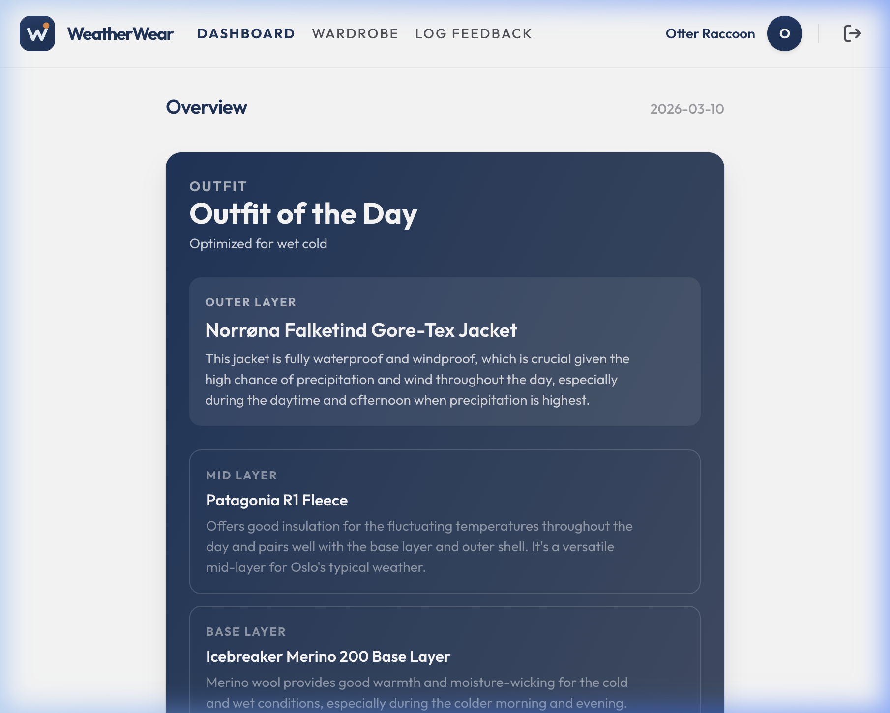
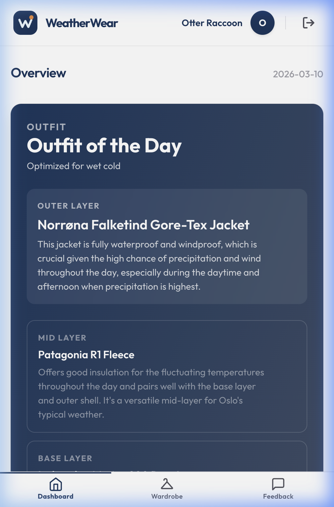
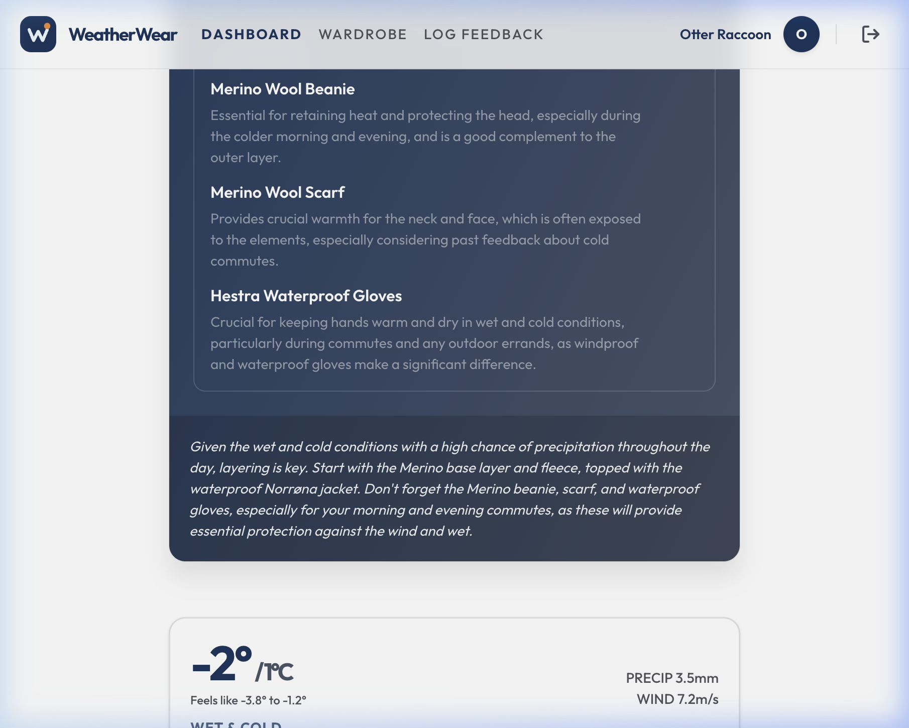
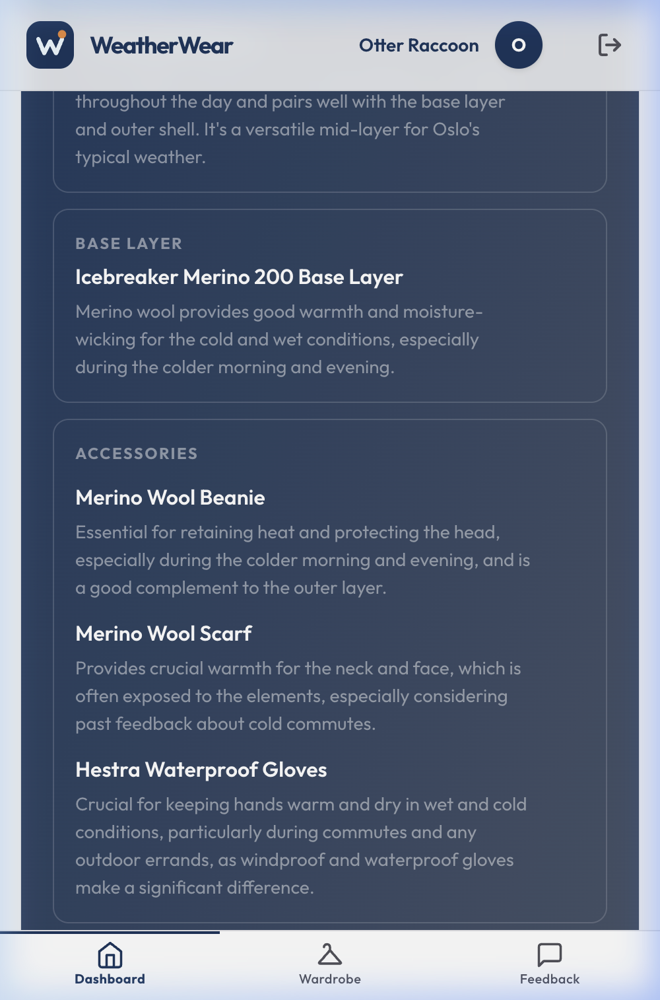
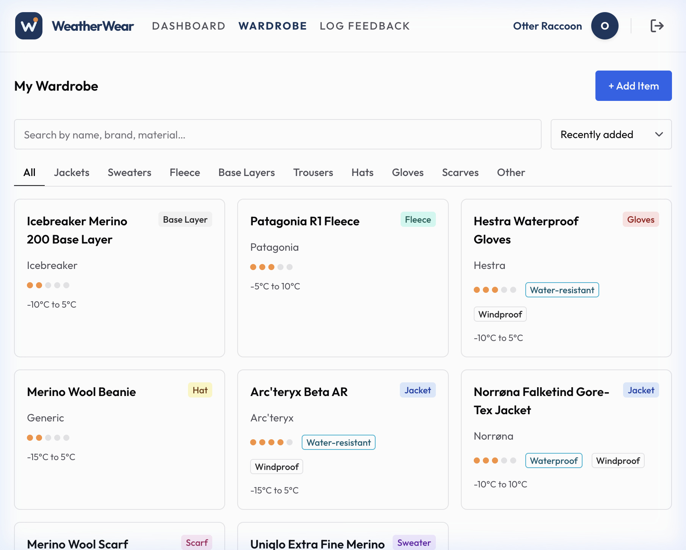
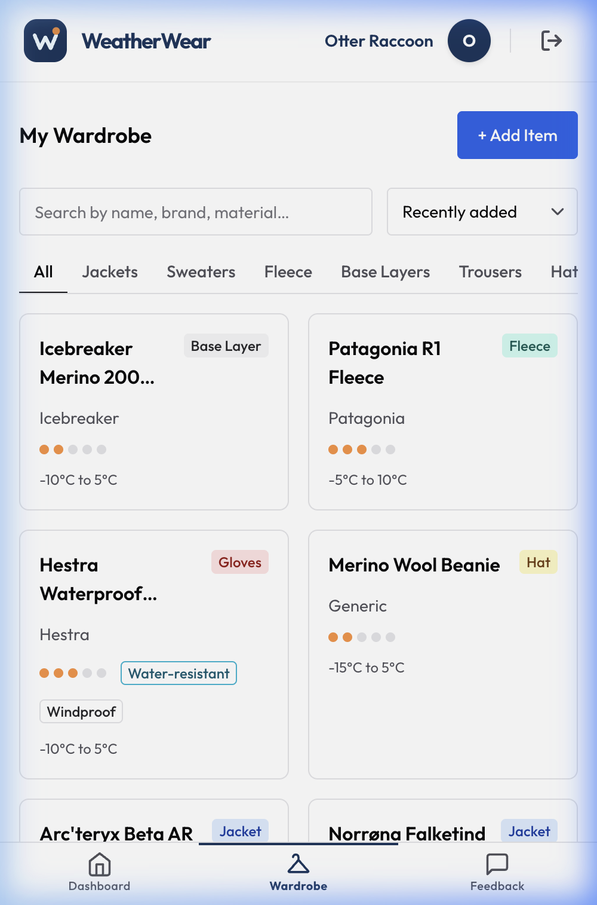

# WeatherWear 🌤️🧥

> A personal clothing suggestion app that recommends outerwear and layering choices each morning based on the full-day weather forecast in Nordic climates.

<p align="center">
  
  
</p>

## 🌟 Overview

**WeatherWear** was born out of a simple problem: deciding what to wear in highly variable climates (like Oslo, Norway) can be challenging — especially if you've migrated from a warmer region. The same -5°C can feel completely different depending on moisture and wind.

This application takes the guesswork out of morning routines by analyzing the full-day weather forecast and providing personalized outerwear and layering recommendations tailored to your specific wardrobe, local weather logic, and personal comfort preferences — all powered by Google Gemini AI.

## ✨ Features

- 🧥 **AI-Powered Daily Outfit Suggestions** — Every morning, get a complete layering recommendation (base → mid → outer + accessories) generated by Google Gemini based on the full-day weather forecast.
- 🌡️ **Smart Weather Classification ("Oslo Logic")** — Goes beyond raw temperature. Classifies conditions into categories like *Wet Slush*, *Windy Cold*, *Dry Cold*, and *Mild Damp* to understand the real *feel* of the day.
- 📸 **Lazy Onboarding via Product URLs** — Add items to your wardrobe simply by pasting a product URL (e.g. Zalando, Norrøna, Uniqlo). The app auto-extracts name, material, warmth level, and weather resistance using AI.
- 🔄 **Feedback & Learning Loop** — Log what you wore and rate your comfort. The AI learns your personal temperature tolerance over time and calibrates future suggestions accordingly.
- 🔐 **Secure & Personal** — Google sign-in via Firebase Auth. Your wardrobe data is private and secured with Firestore rules.

---

## 📸 Screenshots

### Dashboard — Outfit of the Day
The dashboard shows today's AI-generated outfit suggestion with detailed reasoning for each layer, optimized for the current weather conditions.

<p align="center">
  
  
</p>

<p align="center">
  
  
</p>

### Wardrobe Management
A filterable, searchable grid of your clothing items showing warmth levels, weather properties, and temperature ranges at a glance.

<p align="center">
  
  
</p>

---

## 🛠️ Tech Stack

| Layer | Technology |
|-------|-----------|
| **Frontend** | React 19, Vite, TypeScript |
| **UI** | Chakra UI v3, Emotion, React Icons |
| **Backend** | Firebase Cloud Functions |
| **Database** | Firestore |
| **Auth** | Firebase Auth (Google sign-in) |
| **Hosting** | Firebase Hosting |
| **AI** | Google Gemini API (via Firebase) |
| **Weather** | yr.no Locationforecast 2.0 API |

---

## 🏗️ Architecture

```
┌─────────────────────────────────┐
│        React SPA (Vite)         │
│    Dashboard │ Wardrobe │ Login │
└──────────────┬──────────────────┘
               │
    ┌──────────▼──────────┐
    │  Firebase Cloud Fns  │
    │                      │
    │  • getDailySuggestion│
    │  • fetchWeather      │
    │  • crawlProductUrl   │
    │  • submitFeedback    │
    └──┬───────┬───────┬───┘
       │       │       │
  ┌────▼──┐ ┌─▼────┐ ┌▼─────────┐
  │Firestr│ │yr.no │ │Gemini API│
  │  ore  │ │ API  │ │          │
  └───────┘ └──────┘ └──────────┘
```

**How it works:**
1. A scheduled function fetches the hourly forecast from yr.no → aggregates into time periods → classifies with "Oslo Logic" → caches in Firestore.
2. User opens the app → `getDailySuggestion` reads weather + wardrobe + feedback history → builds a structured prompt → Gemini returns a personalized layering recommendation.
3. User can optionally submit comfort feedback to improve future suggestions.

---

## 🚀 Getting Started

### Prerequisites

- **Node.js** v18+
- **Firebase CLI** — `npm install -g firebase-tools`
- A Firebase project (default: `smart-display-172af`)
- Google Gemini API Key

### Installation

1. **Clone the repository:**
   ```bash
   git clone https://github.com/ashenw/weatherwear.git
   cd weatherwear
   ```

2. **Install dependencies:**
   ```bash
   npm install
   ```

3. **Configure environment variables:**
   Copy `.env.example` to `.env.local` and fill in your Firebase and Gemini credentials.

4. **Start Firebase Emulators:**
   ```bash
   ./emulators.sh
   ```

5. **Run the development server:**
   ```bash
   npm run dev
   ```

6. Open `http://localhost:5173` in your browser.

---

## 🧪 Testing

```bash
# Run tests
npm test

# Watch mode
npm run test:watch

# Coverage
npm run test:coverage
```

---

## 📖 Documentation

- [Project Specification](docs/SPEC.md) — full technical spec, data schemas, and API definitions
- [Deployment Guide](docs/DEPLOYMENT.md) — how to deploy to production Firebase
- [Testing Guide](docs/TESTING.md) — testing strategy and fixtures

---

## 📄 License

This project was built for educational / demonstration purposes of an end-to-end AI-powered workflow.
