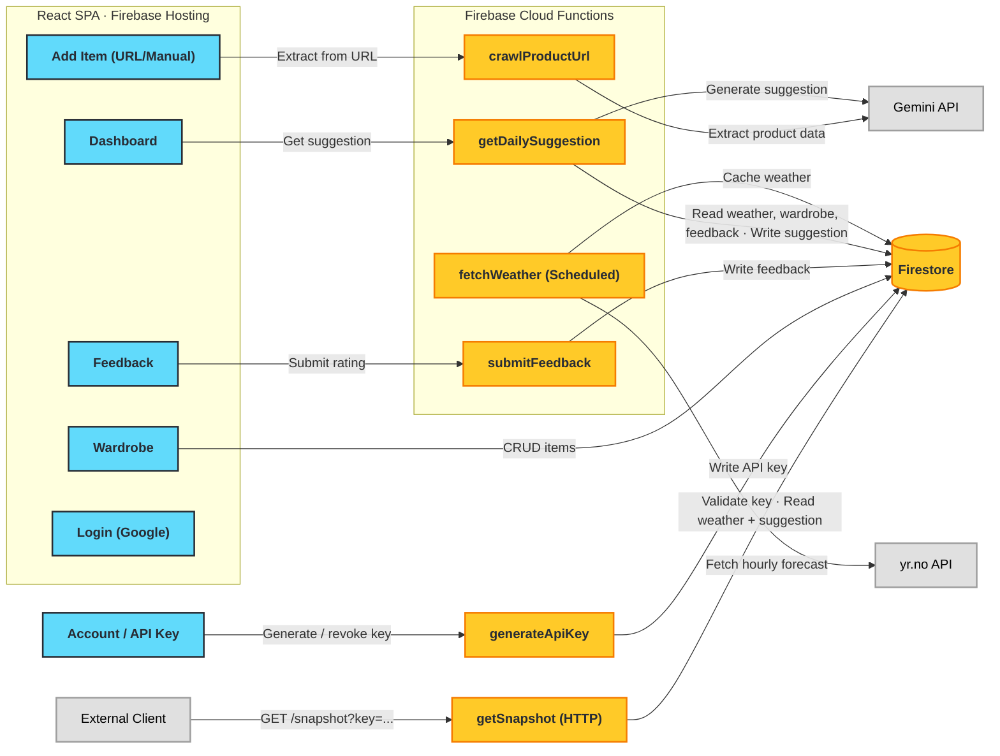

# WeatherWear - Project Specification

## Overview

WeatherWear is a personal clothing suggestion app that recommends outerwear and layering choices each morning based on the full-day weather forecast in Oslo, Norway. Designed for single-user use.

### Problem Statement

As someone who migrated from Sri Lanka to Oslo 3 years ago, deciding what jacket to wear, how many layers to put on, and what accessories to bring (gloves, hat, scarf) remains a daily challenge. Norwegian weather varies significantly and requires wardrobe decisions that aren't intuitive for someone from a tropical climate.

### Solution

A web app that:

1. Stores the user's wardrobe (jackets, sweaters, trousers, accessories) — with lazy onboarding via product URLs
2. Fetches the full-day weather forecast for Oslo from yr.no
3. Classifies weather conditions using Oslo-specific logic (dry cold, wet slush, etc.)
4. Uses Google Gemini to generate personalized outerwear/layering suggestions
5. Learns the user's personal temperature tolerance over time through a feedback loop

## Tech Stack

| Layer        | Technology                        |
|--------------|-----------------------------------|
| Frontend     | React (with Vite)                 |
| UI Library   | Chakra UI v3                      |
| Hosting      | Firebase Hosting                  |
| Backend      | Firebase Cloud Functions          |
| Database     | Firestore (region: eur3)          |
| Auth         | Firebase Auth (Google sign-in)    |
| AI           | Google Gemini API (via Firebase)  |
| Weather data | yr.no API (Locationforecast 2.0)  |

**Dev tooling:** Chakra UI MCP server is used during development for AI-assisted component generation and referencing Chakra's component API.

**Firebase project:** `<your-firebase-project>`

---

## System Architecture



**Data flow for public snapshot (API key access):**

1. External client sends `GET /snapshot?key=<apiKey>`
2. `getSnapshot` HTTP function looks up the hashed key across `apiKeys` documents
3. Validates the key is active and resolves the owning `userId`
4. Reads `weatherCache/{today}` and `users/{userId}/suggestions/{today}`
5. Returns combined weather + suggestion payload (no wardrobe or feedback data is exposed)

**Data flow for daily suggestion:**

1. Scheduled function fetches hourly forecast from yr.no → aggregates into time periods → caches in Firestore
2. User opens app → frontend calls `getDailySuggestion`
3. Function reads cached weather → classifies conditions (Oslo Logic) → reads wardrobe + feedback history → builds Gemini prompt → returns suggestion
4. User optionally submits feedback at end of day (what they wore, comfort rating)

---

## Core Features

### 1. Lazy Onboarding — URL-to-Item

Users can add clothing items to their wardrobe in two ways:

**URL-based entry (primary)** — User pastes a product URL (e.g., from Zalando, Norrøna, Uniqlo):

1. Cloud Function fetches the page HTML
2. The raw HTML/text is sent to Gemini with a structured extraction prompt
3. Gemini extracts: name, category, material/fabric, color, warmth characteristics, waterproof/windproof properties, temperature suitability, and product image URL
4. Extracted data is returned to the frontend for user review
5. User can adjust any fields before saving to Firestore

**Manual entry** — User fills in as much detail as they can provide:
- Name / description
- Category: jacket, sweater, fleece, base layer, trousers, hat, gloves, scarf, other
- Color
- Material / fabric
- Brand
- Warmth level (1–5 scale: 1 = light, 5 = heavy winter)
- Waterproof (yes / no / water-resistant)
- Windproof (yes / no)
- Temperature range suitability (e.g., "0 to -10°C")
- Photo upload
- Notes (free text)

Users can also edit and delete existing wardrobe items.

### 2. Weather-Driven Logic Engine

**Data collection:**
- Fetch hourly forecast from yr.no Locationforecast 2.0 API (`complete` endpoint)
- yr.no returns a timeseries with:

  - **Instant data** (per-hour point-in-time): `air_temperature`, `relative_humidity`, `dew_point_temperature`, `wind_speed`, `wind_speed_of_gust`, `wind_from_direction`, `air_pressure_at_sea_level`, `cloud_area_fraction` (total, high, medium, low), `fog_area_fraction`, `ultraviolet_index_clear_sky`
  - **Period summaries** (`next_1_hours`, `next_6_hours`): `precipitation_amount` (+ min/max), `probability_of_precipitation`, `probability_of_thunder`, `symbol_code`; 6-hour periods also include `air_temperature_min`/`air_temperature_max`

- Aggregate hourly data into time periods:
  - Morning (06:00–09:00)
  - Daytime (09:00–15:00)
  - Afternoon (15:00–18:00)
  - Evening (18:00–21:00)
- For each period, derive:

  - `temp`: average of `air_temperature`
  - `feelsLike`: calculated using wind chill formula (see below)
  - `precipitation`: sum of `precipitation_amount` from `next_1_hours`
  - `precipProbability`: max `probability_of_precipitation` across hours
  - `wind`: average of `wind_speed`
  - `windGust`: max of `wind_speed_of_gust`
  - `humidity`: average of `relative_humidity`
  - `dewPoint`: average of `dew_point_temperature`
  - `cloudCover`: average of `cloud_area_fraction`
  - `symbol`: most frequent `symbol_code` from `next_1_hours`

- Derive daily summary: min/max temperature, total precipitation, max wind speed, avg cloud cover
- Derive `windWarning`: `true` if max wind speed > 8 m/s (passed to Gemini as supplementary context)

**Feels-like temperature calculation:**

yr.no does not provide a feels-like / wind chill field. We calculate it using the standard Environment Canada wind chill formula:
- When `air_temperature` < 10°C and `wind_speed` > 1.3 m/s (4.8 km/h):
  `feelsLike = 13.12 + 0.6215×T - 11.37×V^0.16 + 0.3965×T×V^0.16`
  where T = air temperature (°C), V = wind speed (km/h, convert from m/s × 3.6)
- Otherwise: `feelsLike = air_temperature`

**Weather condition classification — the "Oslo Logic":**

Norwegian weather isn't just about temperature. The same -5°C feels completely different depending on moisture and wind. The system classifies each day into a condition type:

| Condition | Criteria | Layering implication |
| --- | --- | --- |
| Warm | maxTemp > 20°C | Minimal layers |
| Dry Mild | minTemp ≥ 10°C, totalPrecipitation < 1mm | Light jacket or sweater only |
| Dry Cool | minTemp 5–10°C, totalPrecipitation < 1mm | Light jacket, single mid-layer |
| Windy Cold | minTemp < 5°C, maxWind > 8 m/s | Windproof outer, extra face/neck protection |
| Wet Slush | minTemp 0–5°C, totalPrecipitation ≥ 2mm | Waterproof everything, layers for variable temp |
| Wet Cold | minTemp -5–0°C, totalPrecipitation ≥ 1mm, humidity > 80% | Waterproof shell essential, synthetic insulation |
| Mild Damp | minTemp 5–15°C, totalPrecipitation > 0 | Light waterproof layer, single mid-layer |
| Dry Cold | minTemp < 0°C, totalPrecipitation < 1mm | Insulation priority — down jacket, wool layers |
| *(fallback)* | None of the above | Mild Damp |

Rules are evaluated in the order listed above (first match wins). This classification is passed to Gemini as context alongside the raw weather data, so the AI understands the practical feel of the conditions.

**Wind warning flag:** In addition to the primary classification, the system flags `windWarning: true` when `maxWind > 8 m/s` for any condition type (not just Windy Cold). This flag is passed to Gemini alongside the condition type so it can recommend windproof layers even in conditions like Dry Cold or Wet Slush. The flag does not change the primary classification — it's supplementary context.

**Edge case notes:**

- The `wet-cold` upper bound is 0°C (exclusive) to avoid overlap with `wet-slush` (0–5°C)
- `mild-damp` upper bound is 15°C to cover rainy days above the `dry-cool` range (previously would have fallen through to fallback)
- Oslo Logic must be unit tested with boundary values before deployment (e.g., minTemp exactly 0°C, precipitation exactly 1mm, wind exactly 8 m/s)

### 3. Daily Clothing Suggestion

- On opening the web app, the user sees today's outerwear/layering suggestion
- The suggestion is generated by sending to Gemini:
  - Full-day forecast (all time periods with weather data)
  - Oslo Logic condition classification
  - User's complete wardrobe
  - Feedback history (past comfort ratings and what was worn in similar conditions)
- The suggestion accounts for weather variations throughout the day:
  - Dress for the temperature range across all periods, not a single reading
  - Recommend layers that can be added/removed as conditions change (e.g., "bring your fleece for the cold morning, you can take it off by afternoon")
  - Factor in worst-case conditions for the day (e.g., rain expected in the evening → bring waterproof layer even if the morning is dry)
- Gemini produces a recommendation covering:
  - Base layer
  - Mid layer (sweater/fleece)
  - Outer layer (jacket)
  - Accessories (hat, gloves, scarf) if needed
- The suggestion includes reasoning tied to specific times of day
- Suggestions are cached for the day to avoid redundant API calls

### 4. Feedback Loop

At the end of the day (or next morning), the user can record what they actually wore and how comfortable they were:

- Select which wardrobe items they wore
- Rate comfort: too cold / slightly cold / just right / slightly warm / too warm
- Optional note (e.g., "was fine until the wind picked up in the evening")

This feedback is stored in Firestore and included in future Gemini prompts so the AI can learn the user's personal temperature tolerance. For example:

- "User reported being cold in a fleece + softshell at -3°C dry cold → suggest warmer options for similar conditions"
- "User consistently rates 'just right' with light down jacket at 0–5°C → this is their comfort baseline"

### 5. Authentication

- Google sign-in via Firebase Auth
- Single-user app — the auth is primarily to secure access, not for multi-tenancy
- Firestore security rules restrict user data to the authenticated user; weather cache is readable by any authenticated user

### 6. API Key Access

Users can generate a personal API key from the Account page (accessible by clicking their avatar). The key allows **thin clients** — such as e-ink displays (e.g., a Waveshare panel driven by a Raspberry Pi Zero), home-automation dashboards, or simple scripts — to consume today's weather and clothing suggestion via a single public REST endpoint without needing a browser, Firebase SDK, or OAuth flow.

- **One key per user** — generating a new key immediately invalidates the previous one
- The raw key is shown **once** in the UI immediately after generation; it is never stored in plain text
- Keys are stored as a SHA-256 hash in Firestore under `users/{userId}/apiKey` (a single document, not a subcollection)
- The `getSnapshot` HTTP function validates incoming keys by hashing the candidate and searching for a matching document
- Users can also **revoke** their key without generating a replacement (setting `active: false`)
- The Account page shows: current key status (active / none), masked key suffix (last 4 chars), creation date, and buttons to generate/regenerate or revoke

---

## Data Schema (Firestore)

```
weatherCache/{date} (top-level collection, doc ID e.g., "2026-03-01")
  └── { date, fetchedAt,
        conditionType,        // Oslo Logic classification
        periods: {
          morning:   { temp, feelsLike, precipitation, precipProbability,
                       wind, windGust, humidity, dewPoint, cloudCover, symbol },
          daytime:   { ... },
          afternoon: { ... },
          evening:   { ... }
        },
        windWarning,              // boolean — true if maxWind > 8 m/s
        summary: { minTemp, maxTemp,
                   totalPrecipitation, maxWind, avgCloudCover },
        rawTimeseries: [ ... ] // optional: raw hourly data
      }

users/{userId}
  │
  ├── profile (document)
  │     └── { displayName, email, location: "Oslo",
  │           coordinates: { lat: 59.9139, lon: 10.7522 } }
  │
  ├── wardrobe/{itemId} (subcollection)
  │     └── { name, category, color, material, brand,
  │           warmthLevel,          // 1–5
  │           waterproof,           // "yes" | "no" | "water-resistant"
  │           windproof,            // boolean
  │           temperatureRange,     // { min: -10, max: 5 }
  │           photoUrl, sourceUrl,
  │           notes,
  │           extractedByAI,        // boolean — true if from URL crawl
  │           createdAt, updatedAt }
  │
  ├── suggestions/{date} (subcollection, doc ID e.g., "2026-03-01")
  │     └── { date, generatedAt,
  │           conditionType,
  │           forecast,             // snapshot of weather used
  │           suggestion: {
  │             baseLayer:    { itemId, name, reasoning },
  │             midLayer:     { itemId, name, reasoning },
  │             outerLayer:   { itemId, name, reasoning },
  │             accessories:  [ { itemId, name, reasoning } ],
  │             overallAdvice: "..."
  │           },
  │           rawGeminiResponse }
  │
  ├── feedback/{date} (subcollection, doc ID e.g., "2026-03-01")
  │     └── { date, submittedAt,
  │           itemsWorn: [ itemId, itemId, ... ],
  │           comfortRating,        // "too-cold" | "slightly-cold" |
  │                                 // "just-right" | "slightly-warm" | "too-warm"
  │           conditionType,        // Oslo Logic classification that day
  │           weatherSummary,       // snapshot of weather that day
  │           note }
  │
  └── apiKey (document — one per user, not a subcollection)
        └── { keyHash,             // SHA-256 hex digest of the raw key
              keySuffix,           // last 4 chars of raw key (for display only)
              active,              // boolean — false if revoked
              createdAt,
              lastUsedAt }         // updated on each successful /snapshot call
```

---

## API Endpoints / Cloud Function Definitions

### `fetchWeather` — Scheduled (daily at 05:00 CET)

Pre-fetches and caches the day's weather forecast.

- **Trigger:** Firebase scheduled function (pubsub cron)
- **Process:**
  1. Call yr.no API: `GET https://api.met.no/weatherapi/locationforecast/2.0/complete?lat=59.9139&lon=10.7522`
  2. Filter timeseries to today's hours (06:00–21:00)
  3. Aggregate into 4 time periods (morning, daytime, afternoon, evening)
  4. Classify condition type using Oslo Logic rules
  5. Write to `weatherCache/{date}` (top-level collection)
- **Headers:** `User-Agent: WeatherWear/1.0 github.com/ashenw/weatherwear`
- **Error handling:** Retry once on failure; log error if retry fails

### `getDailySuggestion` — Callable

Returns today's clothing suggestion, generating it if not cached.

- **Trigger:** `onCall` (authenticated)
- **Input:** none (uses authenticated user's ID)
- **Process:**
  1. Check `users/{userId}/suggestions/{today}` — return cached if exists
  2. Read `weatherCache/{today}` (top-level) — if missing, fetch weather on-demand
  3. Read all docs from `users/{userId}/wardrobe/` subcollection
  4. Read recent `feedback/` docs (last 14 days)
  5. Build Gemini prompt (see Prompt Engineering section)
  6. Call Gemini API
  7. Parse structured response
  8. Cache in `suggestions/{today}`
  9. Return suggestion to client
- **Response:**

  ```json
  {
    "date": "2026-03-01",
    "conditionType": "wet-cold",
    "forecast": { "periods": { ... }, "summary": { ... } },
    "suggestion": {
      "baseLayer": { "itemId": "...", "name": "Merino wool base", "reasoning": "..." },
      "midLayer": { "itemId": "...", "name": "Fleece jacket", "reasoning": "..." },
      "outerLayer": { "itemId": "...", "name": "Gore-Tex shell", "reasoning": "..." },
      "accessories": [ { "itemId": "...", "name": "Wool beanie", "reasoning": "..." } ],
      "overallAdvice": "It's a wet cold day (-2°C with sleet). Your Gore-Tex shell over the fleece will keep you dry and warm. Bring gloves — the wind picks up after 15:00."
    }
  }
  ```

### `crawlProductUrl` — Callable

Extracts clothing item data from a product page URL.

- **Trigger:** `onCall` (authenticated)
- **Input:** `{ url: string }`
- **Process:**
  1. Validate URL (must be HTTP/HTTPS)
  2. Fetch page HTML (with timeout, max body size)
  3. Strip scripts/styles, extract text content and meta tags
  4. Send to Gemini with extraction prompt (see Prompt Engineering section)
  5. Return structured item data
- **Response:**

  ```json
  {
    "name": "Norrøna Falketind Gore-Tex Jacket",
    "category": "jacket",
    "color": "blue",
    "material": "Gore-Tex 3-layer",
    "brand": "Norrøna",
    "warmthLevel": 3,
    "waterproof": "yes",
    "windproof": true,
    "temperatureRange": { "min": -10, "max": 10 },
    "photoUrl": "https://...",
    "sourceUrl": "https://original-url.com/..."
  }
  ```

### `generateApiKey` — Callable

Generates (or regenerates) the user's personal API key.

- **Trigger:** `onCall` (authenticated)
- **Input:** none
- **Process:**
  1. Generate a cryptographically random 32-byte key, base64url-encoded → `rawKey`
  2. Compute `keyHash = SHA-256(rawKey)` (hex)
  3. Derive `keySuffix` = last 4 characters of `rawKey`
  4. Write (or overwrite) `users/{userId}/apiKey` with `{ keyHash, keySuffix, active: true, createdAt: now, lastUsedAt: null }`
  5. Return `rawKey` to the caller — **this is the only time the raw key is ever transmitted**
- **Response:**

  ```json
  { "apiKey": "<rawKey>" }
  ```

- **Note:** Calling this function again replaces the previous key atomically. The old key stops working immediately.

### `revokeApiKey` — Callable

Deactivates the user's API key without replacing it.

- **Trigger:** `onCall` (authenticated)
- **Input:** none
- **Process:**
  1. Update `users/{userId}/apiKey` → `{ active: false }`
- **Response:** `{ "success": true }`

### `getSnapshot` — Public HTTP GET

Returns today's weather summary and clothing suggestion for a user identified by their API key. This is the only unauthenticated endpoint; it is secured by the API key.

- **Trigger:** `onRequest` (HTTP, unauthenticated — no Firebase Auth token required)
- **URL:** `GET https://<region>-<project>.cloudfunctions.net/getSnapshot?key=<apiKey>`
- **Process:**
  1. Extract `key` query parameter; reject (401) if missing
  2. Compute `candidateHash = SHA-256(key)`
  3. Query Firestore: find `users/{userId}/apiKey` where `keyHash == candidateHash` and `active == true`; reject (401) if not found
  4. Update `lastUsedAt` on the matched document (non-blocking)
  5. Read `weatherCache/{today}` — return 503 with `{ "error": "weather_unavailable" }` if missing
  6. Read `users/{userId}/suggestions/{today}` — run `getDailySuggestion` logic inline if not cached
  7. Return combined payload
- **Response:**

  ```json
  {
    "date": "2026-03-01",
    "weather": {
      "conditionType": "wet-cold",
      "windWarning": false,
      "periods": {
        "morning":   { "temp": -1, "feelsLike": -5, "precipitation": 0.4, "wind": 4.2, "symbol": "lightsnow" },
        "daytime":  { "temp": 1,  "feelsLike": -2, "precipitation": 1.1, "wind": 5.0, "symbol": "sleet" },
        "afternoon": { "temp": 2,  "feelsLike": -1, "precipitation": 0.2, "wind": 3.8, "symbol": "cloudy" },
        "evening":  { "temp": 0,  "feelsLike": -3, "precipitation": 0.0, "wind": 2.1, "symbol": "clearsky_night" }
      },
      "summary": { "minTemp": -1, "maxTemp": 2, "totalPrecipitation": 1.7, "maxWind": 5.0 }
    },
    "suggestion": {
      "baseLayer":    { "itemId": "...", "name": "Merino wool base", "reasoning": "..." },
      "midLayer":     { "itemId": "...", "name": "Fleece jacket",    "reasoning": "..." },
      "outerLayer":   { "itemId": "...", "name": "Gore-Tex shell",   "reasoning": "..." },
      "accessories":  [{ "itemId": "...", "name": "Wool beanie",     "reasoning": "..." }],
      "overallAdvice": "..."
    }
  }
  ```

- **Intended clients:** e-ink displays, Raspberry Pi scripts, home-automation platforms, or any environment where running a Firebase SDK is impractical. A typical e-ink device fetches the snapshot once in the morning via a cron job — the endpoint is deliberately read-only and returns only the data a display needs.
- **Security notes:**
  - Rate-limit by IP: max 60 requests/minute per IP (Cloud Armor or a simple Firestore counter)
  - Never expose `keyHash`, wardrobe items, or feedback data in the response
  - Use `timing-safe` comparison when checking the hash to prevent timing attacks (compare full SHA-256 digests, never short-circuit)

### `submitFeedback` — Callable

Records the user's daily outfit feedback.

- **Trigger:** `onCall` (authenticated)
- **Input:**

  ```json
  {
    "date": "2026-03-01",
    "itemsWorn": ["itemId1", "itemId2"],
    "comfortRating": "slightly-cold",
    "note": "optional note"
  }
  ```
- **Process:**
  1. Read `weatherCache/{date}` (top-level) to snapshot weather conditions
  2. Write to `users/{userId}/feedback/{date}`
- **Response:** `{ "success": true }`

---

## Prompt Engineering Strategy

### Onboarding Prompt — Product URL Extraction

Used in `crawlProductUrl` when Gemini processes scraped page content.

```
You are a clothing product data extractor. Given the raw text content
from a product web page, extract the following structured information
about the clothing item.

Return a JSON object with these fields:
- name: Product name
- category: One of [jacket, sweater, fleece, base-layer, trousers,
  hat, gloves, scarf, other]
- color: Primary color
- material: Main fabric/material (e.g., "Gore-Tex", "merino wool",
  "polyester fleece")
- brand: Brand name
- warmthLevel: Integer 1–5 based on the product description and
  material (1 = ultralight summer, 2 = light spring/fall,
  3 = moderate cold, 4 = cold winter, 5 = extreme cold)
- waterproof: One of ["yes", "no", "water-resistant"]
- windproof: boolean
- temperatureRange: { min: number, max: number } in Celsius —
  estimate the comfortable temperature range based on the product
  type and materials
- photoUrl: Main product image URL if found in the page

If any field cannot be determined from the page content, set it to null.

PAGE CONTENT:
{scraped_text}
```

### Recommendation Prompt — Daily Suggestion

Used in `getDailySuggestion` when Gemini generates the outfit recommendation.

```
You are a personal clothing advisor for someone living in Oslo, Norway
who moved from Sri Lanka 3 years ago. They are still adapting to
Nordic weather and tend to {comfort_tendency} based on past feedback.

TODAY'S WEATHER IN OSLO:
Condition type: {condition_type} (e.g., "Wet Cold", "Dry Cold")
Morning (06–09):   {morning_temp}°C (feels like {morning_feels}°C),
                   {morning_precip}mm precip, wind {morning_wind} m/s
Daytime (09–15):   {daytime_data}
Afternoon (15–18): {afternoon_data}
Evening (18–21):   {evening_data}
Summary: {min_temp}°C to {max_temp}°C, total {total_precip}mm precipitation

THEIR WARDROBE:
{wardrobe_items_json}

PAST FEEDBACK (last 14 days):
{feedback_entries}

Based on the full-day forecast, recommend what to wear today.
Consider that they will be outside during transitions between periods
(commute, errands) and should be prepared for the worst conditions
of the day.

Return a JSON object:
{
  "baseLayer":    { "itemId": "...", "reasoning": "..." },
  "midLayer":     { "itemId": "...", "reasoning": "..." },
  "outerLayer":   { "itemId": "...", "reasoning": "..." },
  "accessories":  [{ "itemId": "...", "reasoning": "..." }],
  "overallAdvice": "2–3 sentence summary explaining the recommendation
                    with references to specific times of day"
}

Important:
- Only recommend items that exist in their wardrobe
- If the wardrobe is missing an essential item for today's conditions,
  mention this in overallAdvice
- Reference specific times of day in your reasoning
- Account for the user's comfort tendency from feedback history
```

**Comfort tendency derivation:** Before building the prompt, the function analyzes recent feedback to determine a tendency string:

- Mostly "too-cold" / "slightly-cold" → `"feel the cold more than average"`
- Mostly "just-right" → `"have well-calibrated cold tolerance"`
- Mostly "too-warm" / "slightly-warm" → `"tend to run warm"`

---

## Web App Pages

| Page              | Description                                                       |
|-------------------|-------------------------------------------------------------------|
| `/`               | Dashboard — today's weather summary + clothing suggestion         |
| `/wardrobe`       | List all wardrobe items with filters by category                  |
| `/wardrobe/add`   | Add item — URL input with auto-extract, or manual form            |
| `/wardrobe/:id`   | Edit/view item detail                                             |
| `/feedback`       | Submit today's feedback (what you wore + comfort rating)          |
| `/login`          | Google sign-in                                                    |
| `/account`        | Account page — API key management (generate, regenerate, revoke)  |

---

## MVP Roadmap

### Phase 0 — Experiment (foundation) ✅

**Goal:** Prove the concept works end-to-end with minimal UI.

- [x] Set up React + Vite project with Firebase SDK
- [x] Implement Firebase Auth (Google sign-in)
- [x] Set up Firestore security rules
- [x] Build `fetchWeather` Cloud Function — fetch yr.no data, aggregate into periods, classify with Oslo Logic, cache in Firestore
- [x] Build a minimal dashboard page that displays cached weather data
- [x] Test yr.no API integration and verify data model

### Phase 1 — Core Suggestion (MVP) ✅

**Goal:** Get daily clothing suggestions working.

- [x] Build manual wardrobe entry form + Firestore CRUD
- [x] Build wardrobe list page
- [x] Build `getDailySuggestion` Cloud Function — read weather + wardrobe, call Gemini, return suggestion
- [x] Design and iterate on the recommendation prompt
- [x] Build dashboard suggestion display — show layering recommendation with reasoning
- [x] Schedule `fetchWeather` to run daily at 05:00 CET

### Phase 2 — Lazy Onboarding ✅

**Goal:** Make it easy to populate the wardrobe.

- [x] Build `crawlProductUrl` Cloud Function — fetch URL, extract with Gemini
- [x] Design and iterate on the extraction prompt
- [x] Build URL-based add item flow in frontend — paste URL → preview extracted data → edit → save
- [x] Handle edge cases (invalid URLs, pages that block crawling, missing data)

### Phase 3 — Feedback Loop

**Goal:** Personalize suggestions over time.

- [ ] Build `submitFeedback` Cloud Function
- [ ] Build feedback page in frontend — select items worn, rate comfort
- [ ] Integrate feedback history into the recommendation prompt
- [ ] Derive and apply comfort tendency analysis

### Phase 4 — Polish (v1.0)

**Goal:** Make it reliable and pleasant to use daily.

- [ ] Improve UI/UX — responsive design, loading states, error handling
- [ ] Add wardrobe photo upload (Firebase Storage)
- [ ] Add wardrobe category filters and search
- [ ] Handle edge cases — empty wardrobe, missing weather data, API failures
- [ ] Deploy to production Firebase

### Phase 5 — API Key Access

**Goal:** Let users consume their daily snapshot from external tools via a single REST call.

- [ ] Build `generateApiKey` Cloud Function — generate random key, store SHA-256 hash, return raw key once
- [ ] Build `revokeApiKey` Cloud Function — set `active: false` on the user's key document
- [ ] Build `getSnapshot` HTTP Cloud Function — validate API key hash, return combined weather + suggestion
- [ ] Add Firestore security rules for `users/{userId}/apiKey` — owner read/write only
- [ ] Build Account page (`/account`) in frontend — accessible via avatar click in the header
- [ ] Account page: show key status (active / none), masked suffix, creation date
- [ ] Account page: "Generate API key" / "Regenerate" button — show raw key once in a copy-to-clipboard dialog
- [ ] Account page: "Revoke" button with confirmation dialog
- [ ] Document the `/snapshot` endpoint in README for external integrations

---

## Future Enhancements (Out of Scope for v1)

- **Push notifications / email** — morning notification with the daily suggestion
- **Activity-based suggestions** — input daily plans (outdoor activity, office, commute) to refine recommendations
- **Full outfit suggestions** — expand beyond outerwear to suggest complete outfits (tops, trousers, shoes)
- **Multiple users** — support household members with separate wardrobes
- **Gemini API rate limiting & cost controls** — per-user daily caps on suggestion regenerations (e.g., max 3/day) and product URL extractions (e.g., max 10/hour); track and alert on monthly Gemini API spend
- **Comfort profile (preference learning)** — aggregate feedback into a structured user comfort profile (temperature offset, per-condition warmth bias, wind sensitivity) instead of passing raw feedback entries to Gemini; update profile after each feedback submission using exponential moving average so recent feedback weighs more

---

## External API Notes

### yr.no Locationforecast 2.0

- Endpoint: `https://api.met.no/weatherapi/locationforecast/2.0/complete`
- Oslo coordinates: lat=59.9139, lon=10.7522
- We use the `complete` endpoint (not `compact`) to access all available parameters
- **Instant parameters** (per-hour, point-in-time):
  - `air_temperature` (°C) — at 2m above ground
  - `relative_humidity` (%) — at 2m above ground
  - `dew_point_temperature` (°C) — at 2m above ground
  - `wind_speed` (m/s) — at 10m, 10-min average
  - `wind_speed_of_gust` (m/s) — max gust at 10m
  - `wind_from_direction` (degrees) — 0° = north, 90° = east
  - `air_pressure_at_sea_level` (hPa)
  - `cloud_area_fraction` (%) — total cloud cover
  - `cloud_area_fraction_high/medium/low` (%) — by altitude band
  - `fog_area_fraction` (%)
  - `ultraviolet_index_clear_sky` (0–11+)
- **Period summaries** (`next_1_hours`, `next_6_hours`):
  - `precipitation_amount` (mm) — expected precipitation (+ `_min`, `_max` variants)
  - `probability_of_precipitation` (%)
  - `probability_of_thunder` (%)
  - `symbol_code` — weather icon identifier (e.g., `cloudy`, `lightrainshowers_day`)
  - `air_temperature_min/max` (°C) — only in `next_6_hours`
- Note: `next_1_hours` summaries are unavailable beyond 60-hour forecast range
- Requires `User-Agent` header (e.g., `WeatherWear/1.0 github.com/ashenw/weatherwear`)
- Must respect `Expires` and `Last-Modified` headers; use `If-Modified-Since` for conditional requests
- Terms: <https://developer.yr.no/doc/TermsOfService/>
- Free, no API key required

### Google Gemini API

- Accessed via Firebase AI / Vertex AI SDK or `@google/generative-ai` package
- API key stored in Firebase environment config / Secret Manager
- Used for two distinct tasks: product data extraction (onboarding) and outfit recommendation (daily suggestion)
